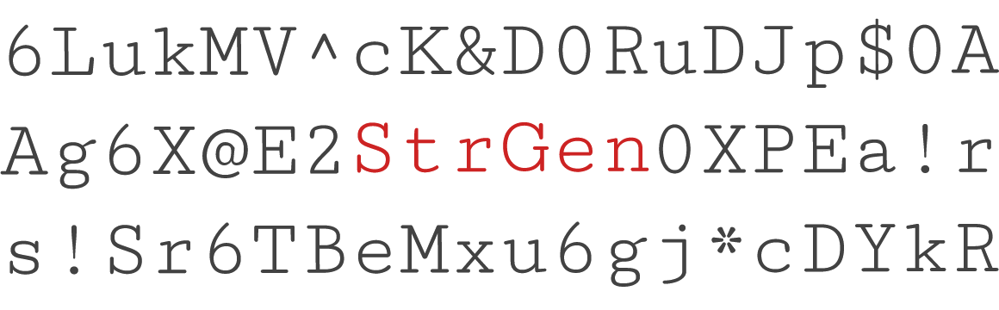

<p align="center">
    
</p>

<p align="center">
    <a href="https://github.com/PHLAK/StrGen/discussions"></a>
    <a href="https://github.com/users/PHLAK/sponsorship"></a>
    <a href="https://paypal.me/ChrisKankiewicz"></a>
    <br>
    <a href="https://packagist.org/packages/phlak/strgen"></a>
    <a href="https://packagist.org/packages/phlak/strgen"></a>
    <a href="https://packagist.org/packages/phlak/strgen"></a>
    <a href="https://github.com/PHLAK/StrGen/actions" alt="Build Status"></a>
</p>

<p align="center">
    PHP library for simple secure random string generation (e.g. - passwords / salts)
    <br>
    Created by <a href="https://www.ChrisKankiewicz.com">Chris Kankiewicz</a> (<a href="https://twitter.com/PHLAK">@PHLAK</a>)
</p>

---

Requirements
------------

  - [PHP](https://php.net) >= 7.2

Install with Composer
---------------------

```bash
composer require phlak/strgen
```

Usage
-----

```php
// Import StrGen
use PHLAK\StrGen;

// Initialize the Generator
$generator = new StrGen\Generator();

// Generate a random string of characters
$generator->length(16)->generate(); // Returns something like '8a*Ag@I0*s0v[S3u'
```

### Character Sets

StrGen has a few built-in character sets available for ease of use. You can
specify which set(s) to use by passing a character set or an array of sets to
the `charset()` method.

**Example using built-in sets:**

```php
$generator = new StrGen\Generator();

$generator->charset(StrGen\CharSet::ALPHA_NUMERIC)->generate();

// or

$generator->charset([StrGen\CharSet::MIXED_ALPHA, StrGen\CharSet::NUMERIC])->generate();
```

**Available presets:**

| Key                             | Character Set                |
| ------------------------------- | ---------------------------- |
| `StrGen\CharSet::LOWER_ALPHA`   | `abcdefghijklmnopqrstuvwxyz` |
| `StrGen\CharSet::UPPER_ALPHA`   | `ABCDEFGHIJKLMNOPQRSTUVWXYZ` |
| `StrGen\CharSet::MIXED_ALPHA`   | `abcdefghijklmnopqrstuvwxyz`<br>`ABCDEFGHIJKLMNOPQRSTUVWXYZ` |
| `StrGen\CharSet::NUMERIC`       | `0123456789` |
| `StrGen\CharSet::ALPHA_NUMERIC` | `abcdefghijklmnopqrstuvwxyz`<br>`ABCDEFGHIJKLMNOPQRSTUVWXYZ`<br>`0123456789` |
| `StrGen\CharSet::SPECIAL`       | `!@#$%^&*()-_=+.?{}[]<>:;/\\|~` |
| `StrGen\CharSet::ALL`           | `abcdefghijklmnopqrstuvwxyz`<br>`ABCDEFGHIJKLMNOPQRSTUVWXYZ`<br>`0123456789`<br>`!@#$%^&*()-_=+.?{}[]<>:;/\\|~` |

**Custom sets:**

You can also manually define a character set by passing a string of characters
to the `charset()` method.

```php
$generator = new StrGen\Generator();

$generator->charset('0123456789abcdef')->generate();
```

### Convenience Functions

StrGen also has built-in convenience functions for generating strings from the
included character sets or a custom character set.

```php
$generator->lowerAlpha($length);
$generator->upperAlpha($length);
$generator->mixedAlpha($length);
$generator->numeric($length);
$generator->alphaNumeric($length);
$generator->special($length);
$generator->all($length);
$generator->custom($length, $charset);
```

Changelog
---------

A list of changes can be found on the [GitHub Releases](https://github.com/PHLAK/StrGen/releases) page.

Troubleshooting
---------------

For general help and support join our [Spectrum community](https://spectrum.chat/phlaknet).

Please report bugs to the [GitHub Issue Tracker](https://github.com/PHLAK/StrGen/issues).

Copyright
---------

This project is licensed under the [MIT License](https://github.com/PHLAK/StrGen/blob/master/LICENSE).
